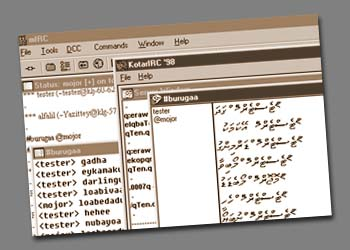



## An IRC Client

### Description

This might be the first most complete IRC clinet developed in Vb so far.This is originally developed to be used by a RTL (right to left) IRC enabled clinet for Dhievhi (an Hebre, arabic like language) for Maldivians (maldives a small island nation of more then 1000 island in the middle of indian ocean). The client has a Laytin to Thaana(dhivehi) converter and also suports english. This code is very useful if you are developing an irc client. The total thing works, though still under development. it works (minor bugs).it uses winsock and pure vb. I started the project back in 1998, and is still lagging... maybe i could get some help and develop the whole thing and finish it off! and yeah thanks for those who contributed to the code! Check it out and vote! any comments most welcome
 
### More Info
 

             |
---                |---
**Submitted On**   |1998-11-10 17:21:26
**By**             |[Sofwathullah Mohamed](https://github.com/Planet-Source-Code/PSCIndex/blob/master/ByAuthor/sofwathullah-mohamed.md)
**Level**          |Advanced
**User Rating**    |4.0 (32 globes from 8 users)
**Compatibility**  |VB 5\.0, VB 6\.0
**Category**       |[Internet/ HTML](https://github.com/Planet-Source-Code/PSCIndex/blob/master/ByCategory/internet-html__1-34.md)
**World**          |[Visual Basic](https://github.com/Planet-Source-Code/PSCIndex/blob/master/ByWorld/visual-basic.md)
**Archive File**   |[CODE\_UPLOAD136801112001\.zip](https://github.com/Planet-Source-Code/sofwathullah-mohamed-an-irc-client__1-14339/archive/master.zip)

